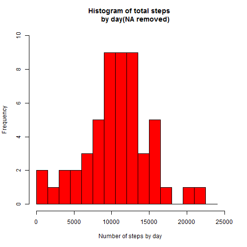
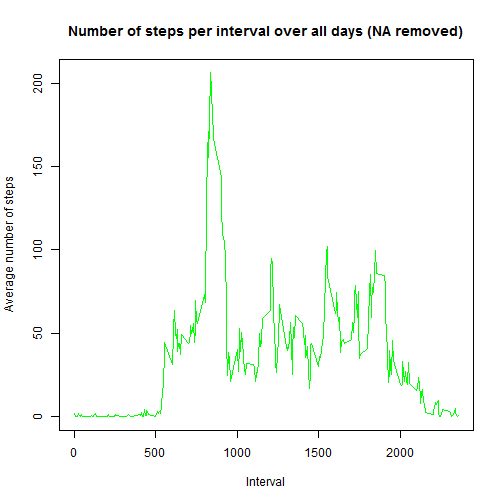
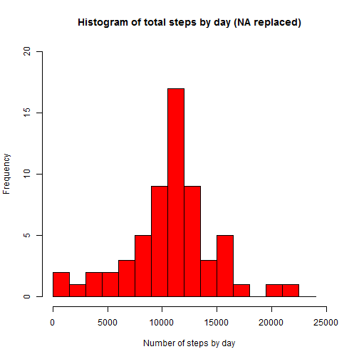
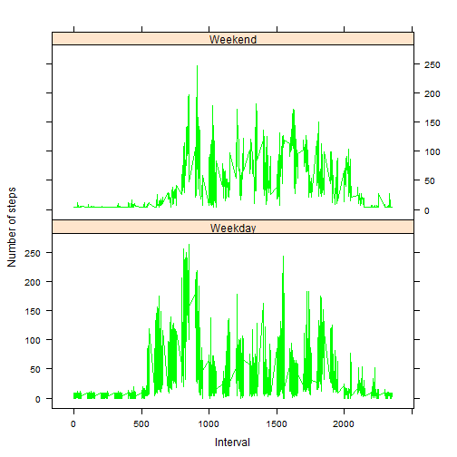

Reproducible Research: Peer Assessment 1
===========================================================

Nov. 06, 2015

This is an R Markdown document for Peer Assessment 1 of online course "Reproducible Research". In this assignment, I will read, process and 
plot the data to answer the questions.

Step 1: Loading and preprocessing the data
------------------------------------------------------------


```r
setwd("F:/CuiHuan/data Science/Course5_Reproducible_Research/project1")
library(dplyr)
```

```
## 
## Attaching package: 'dplyr'
## 
## The following objects are masked from 'package:stats':
## 
##     filter, lag
## 
## The following objects are masked from 'package:base':
## 
##     intersect, setdiff, setequal, union
```

```r
library(lattice)

#load the raw data
activity<-read.csv("activity.csv")

#convert the date to the format sutible for analysis 
activity$date<-as.Date(activity$date, "%Y-%m-%d")

#Create a new factor variable in the dataset with two levels - 
#"weekday" and "weekend"
activity_new<-mutate(activity, weekday=weekdays(activity$date))
activity_new<-mutate(activity_new, daytype=weekday)
activity_new$daytype[activity_new$daytype %in% 
                             c("Saturday", "Sunday")]<-"Weekend"
activity_new$daytype[activity_new$daytype !="Weekend"]<-"Weekday"
```


Step 2: make plots, do calculations to answer the questions
--------------------------------------------------------------

###Question 1: What is mean total number of steps taken per day? 

For this part of the assignment, I will ignore the missing values 
in the dataset.

The histogram of the total number of steps taken each day is given by the following code:


```r
#Calculate the total number of steps taken per day

by_day<-group_by(activity_new, date)
steps_by_day<-summarise(by_day, steps=sum(steps))
steps_by_day<-filter(steps_by_day, !is.na(steps_by_day$steps))

#Make a histogram of the total number of steps taken each day

hist(steps_by_day$steps, main = "Histogram of total steps 
     by day(NA removed)", 
     xlab = "Number of steps by day", ylab = "Frequency", 
     col = "red", xlim = c(0, 25000), ylim = c(0, 10),
     breaks=seq(from=0, to=25000, by=1500))
```

 

Calculate and report the mean and median of the total number of steps taken per day:


```r
steps_mean<-mean(steps_by_day$steps)
steps_median<-median(steps_by_day$steps)
result<-cbind(steps_mean, steps_median)
```

The Mean and Median number of steps per day is:

```r
result
```

```
##      steps_mean steps_median
## [1,]   10766.19        10765
```


### Question 2: What is the average daily activity pattern?
1.Make a time series plot (i.e. type = "l") of the 5-minute interval (x-axis) 
and the average number of steps taken, averaged across all days (y-axis)


```r
steps_by_interval<-aggregate(activity_new$steps, 
                             by=list(activity_new$interval),
                             FUN=mean, na.rm=TRUE)


names(steps_by_interval)<-c("interval", "meansteps")

plot(steps_by_interval$interval, steps_by_interval$meansteps, type='l', 
     main="Number of steps per interval over all days (NA removed)", xlab="Interval", 
     ylab="Average number of steps", col="green")
```

 

2.Which 5-minute interval, on average across all the days in the dataset, 
contains the maximum number of steps? 


```r
max=max(steps_by_interval$meansteps)
max_row<-which(steps_by_interval$meansteps==max)
max_interval<-steps_by_interval[max_row,]
```

Therfore the 5-minute interval contains the maximum number of steps is:

```r
max_interval
```

```
##     interval meansteps
## 104      835  206.1698
```


### Question 3: Imputing missing values

1.Calculate and report the total number of missing values in the 
dataset (i.e. the total number of rows with NAs)


```r
NA_number<-sum(is.na(activity$steps))
```

The number of missing values in the dataset is:

```r
NA_number
```

```
## [1] 2304
```

2&3.Devise a strategy for filling in all of the missing values in the 
dataset. The strategy does not need to be sophisticated. For example, 
you could use the mean/median for that day, or the mean for that 
5-minute interval, etc. Create a new dataset that is equal to the original 
dataset but with the missing data filled in.

Here I use the mean steps for every 5 minutes interval to Create a new dataset 
that is equal to the original dataset but with the missing data filled in:


```r
#calculate the mean for 5 minutes interval
mean_steps_interval<-mean(steps_by_interval$meansteps)  

#replace NA with the calculated value
for (i in 1:nrow(activity_new)){
        if(is.na(activity_new$steps[i])) {
                activity_new$steps[i]<-mean_steps_interval
        }
}
```

4.Make a histogram of the total number of steps taken each day 
and Calculate and report the mean and median total number of steps 
taken per day

```r
#group data by day
by_day<-group_by(activity_new, date)
all_steps_by_day<-summarise(by_day, steps=sum(steps))

#plot the total number of steps taken each day
hist(all_steps_by_day$steps, main = "Histogram of total steps by day (NA replaced)", 
     xlab = "Number of steps by day", ylab = "Frequency", 
     col = "red", xlim = c(0, 25000), ylim = c(0, 20),
     breaks=seq(from=0, to=25000, by=1500))
```

 

```r
all_steps_mean<-mean(all_steps_by_day$steps)
all_steps_median<-median(all_steps_by_day$steps)
result_day<-cbind(all_steps_mean, all_steps_median)
```

Now the Mean and Median number of total steps are:

```r
result_day
```

```
##      all_steps_mean all_steps_median
## [1,]       10766.19         10766.19
```


### Question 4: Are there differences in activity patterns between weekdays and weekends?

1&2.Create a new factor variable in the dataset with two levels - 
"weekday" and "weekend" indicating whether a given date is a 
weekday or weekend day. Make a panel plot containing a time series plot 
(i.e. type = "l") of the 5-minute interval (x-axis) and the average number of 
steps taken, averaged across all weekday days or weekend days (y-axis)


```r
steps_by_daytype<-aggregate(activity_new$steps, 
                             by=list(activity_new$daytype, 
                                     activity_new$weekday,
                                     activity_new$interval),
                             FUN=mean)
names(steps_by_daytype)<-c("daytype", "weekday", "interval", "meansteps")

xyplot(meansteps ~ interval | daytype, data=steps_by_daytype, 
       type="l", 
       layout=c(1,2),
       xlab="Interval", 
       ylab="Number of steps", 
       col="green")
```

 


